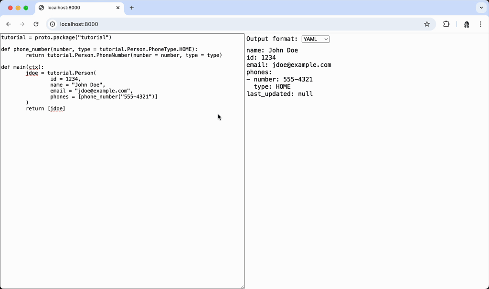

# Skycfg in WebAssembly



Please run the following to build the appropriate WASM file.
```sh
GOOS=js GOARCH=wasm go build -o skycfg.wasm
cp "$(go env GOROOT)/lib/wasm/wasm_exec.js" .
```

Then, serve this directory using any HTTP server. Example using Python's [http.server](https://docs.python.org/3/library/http.server.html):
```sh
python -m http.server 8000
```

Then, you can visit http://127.0.0.1:8000/ to view the demo.
